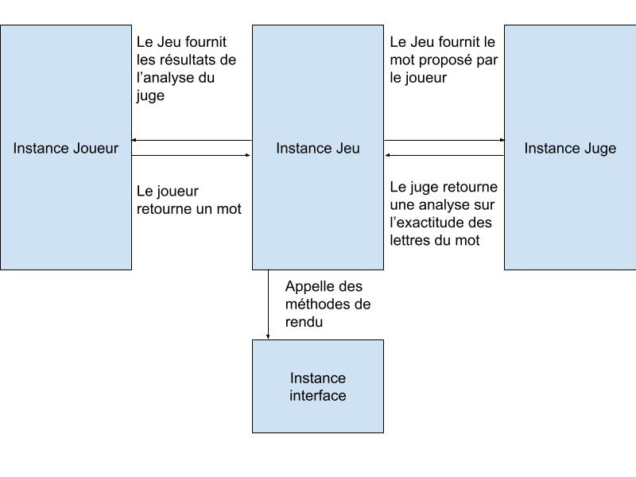

Le projet a été réécrit en Java 17, pour de meilleurs capacité orienté objets, et de meilleurs performances en général.

packages:
* `wordle` est le package principal du projet, il comprend la définition des 4 classes fondamentales de notre jeu:
    * `Judge`: Classe abstraite qui à pour fonction de juger l'exactitude d'un mot par rapport à un mot secret.

        * `Automatic` hérite de `Judge`, c'est un juge qui permet la vérification automatique d'un mot proposé par rapport à un mot secret, fourni lors de la l'instanciation de la classe.
        * `Human` hérite de `Judge`. Il offre la possibilité à l'utilisateur d'être un juge et de donner un retour au joueur à travers l'entrée standard. L'utilisation de ce juge peut être intéressante lorsque le joueur connaît le mot secret qu'il veut le faire deviner à l'ordinateur

    * `Player`: Classe abstraite qui représente un joueur, il doit être apte à choisir un mot a proposer au juge selon les résultats précédents
        * `Human` hérite de `Players`. Il fait jouer l'utilisateur à travers l'entrée standard.
        * `Bot` hérite de `Players` représente l'interêt du projet, il implémente un algorithme de raisonnement par élimination pour optimiser ses chances de réussite. Il choisit les mot à proposer au Juge par lui même.
    * `Interface`: Ironiquement l'objet `Interface` est une interface et non une classe abstraite. Elle doit implémenter des méthodes de "rendu" qui sont appelés par une instance de jeu lors d'évènements particuliers.
        * `Shadow` implémente `Interface`, permet juste de lancer une partie sans interface utilisateur (l'instance d'une `Interface` étant nécessaire à la construction d'un objet `Game`).
        * `Monochromatic` implémente `Interface`, affiche des rendu à travers le terminal en noir et blanc.
        * `Colored` implémente `Interface` est une version améliorée de `Monochromatic` qui prends avantages des codes ANSI pour afficher des caractères en couleurs dans le terminal.

    * `Game`: Classe qui permet la simulation à partir d'un juge (`Judge`), un joueur (`Player`) et d'une interface (`Interface`). Il est à l'origine de la modularité du projet car elle s'occuppe de la mise en relation de chacun des objets cités précédemment et s'assure du bon fonctionnement du jeu.

Nous pouvons résumer la simulation d'une partie à travers ce schéma

* `Alpha` est un package apportant un ensemble de fonctions et de structures de données adaptés à la manipulation de lettres alphabétiques
    * `Alpha` implémente un lot de fonctions, pour vérifier la validité d'une lettre majuscule
    * `AlphaSet` implémente `Set`
    * `AlphaMap` implémente `Map`

* `dictionary` comprends uniquement `Dictionary.java`, qui permet la lecture d'un dictionnaire de mot contenu locallement dans un fichier texte.