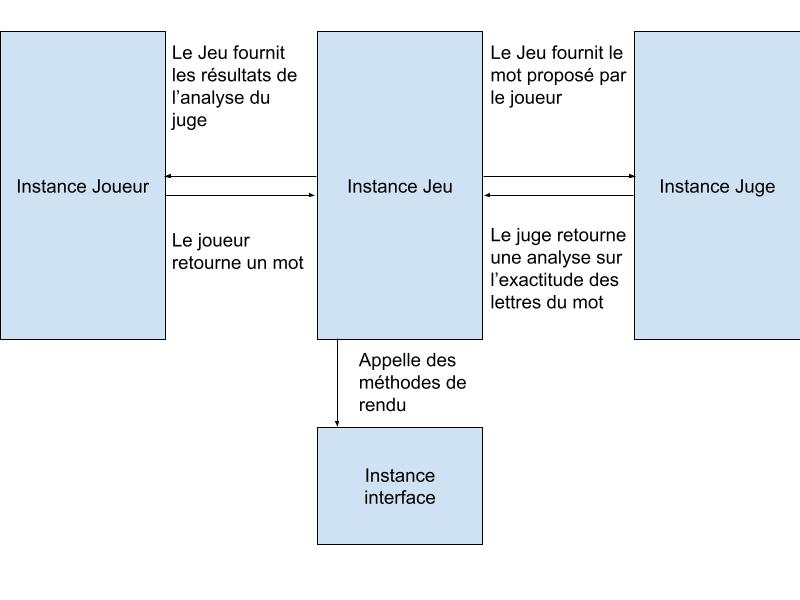

Le projet a été réécrit en Java 17, pour de meilleures capacités orientées objet, et de meilleures performances en général.

**Packages :**

* `wordle` est le package principal du projet. Il comprend la définition des quatre classes fondamentales de notre jeu :
    * `Judge` : classe abstraite dont la fonction est de juger l’exactitude d’un mot par rapport à un mot secret.
        * `Automatic` hérite de `Judge`. C’est un juge qui permet la vérification automatique d’un mot proposé par rapport à un mot secret, fourni lors de l’instanciation de la classe.
        * `Human` hérite de `Judge`. Il offre la possibilité à l’utilisateur d’être un juge et de donner un retour au joueur via l’entrée standard. L’utilisation de ce juge peut être intéressante lorsque le joueur connaît le mot secret qu’il veut faire deviner à l’ordinateur.

    * `Player` : classe abstraite représentant un joueur, qui doit être capable de choisir un mot à proposer au juge en fonction des résultats précédents.
        * `Human` hérite de `Player`. Il permet à l’utilisateur de jouer via l’entrée standard.
        * `Bot` hérite de `Player`. Il représente l’intérêt principal du projet : il implémente un algorithme de raisonnement par élimination pour optimiser ses chances de réussite. Il choisit lui-même les mots à proposer au juge.

    * `Interface` : ironiquement, l’objet `Interface` est une interface et non une classe abstraite. Elle doit implémenter des méthodes de « rendu » qui sont appelées par une instance de jeu lors d’événements particuliers.
        * `Shadow` implémente `Interface`. Elle permet simplement de lancer une partie sans interface utilisateur (une instance d’`Interface` étant nécessaire à la construction d’un objet `Game`).
        * `Monochromatic` implémente `Interface`. Elle affiche des rendus à travers le terminal en noir et blanc.
        * `Colored` implémente `Interface`. C’est une version améliorée de `Monochromatic`, qui tire parti des codes ANSI pour afficher des caractères en couleur dans le terminal.

    * `Game` : classe qui permet la simulation d’une partie à partir d’un juge (`Judge`), d’un joueur (`Player`) et d’une interface (`Interface`). Elle est à l’origine de la modularité du projet, car elle s’occupe de la mise en relation de chacun des objets cités précédemment et s’assure du bon fonctionnement du jeu.

Nous pouvons résumer la simulation d’une partie à travers ce schéma :  

* `Alpha` est un package apportant un ensemble de fonctions et de structures de données adaptées à la manipulation de lettres alphabétiques :
    * `Alpha` implémente un ensemble de fonctions permettant de vérifier la validité d’une lettre majuscule.
    * `AlphaSet` implémente `Set`.
    * `AlphaMap` implémente `Map`.

* `dictionary` comprend uniquement `Dictionary.java`, qui permet la lecture d’un dictionnaire de mots contenu localement dans un fichier texte.
